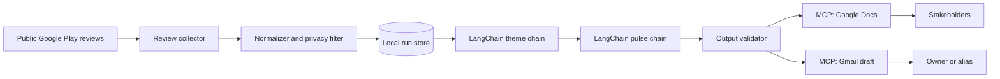

# Architecture: Groww Weekly Review Pulse

## Purpose and Scope

This Python system uses LangChain to turn recent public Google Play reviews for Groww into a weekly product-health pulse. It retrieves reviews from the preceding 8-12 weeks, removes identifying information, groups feedback into no more than five themes, and produces a stakeholder-ready note of 250 words or fewer.

The system publishes the note to Google Docs and creates a Gmail draft through MCP tools. It must not implement direct Google OAuth or REST clients.

### In Scope

- Public Play Store review collection for `com.nextbillion.groww`.
- Review normalization, date filtering, PII removal, thematic clustering, and ranking.
- A weekly note with three top themes, three verbatim anonymous quotes, and three grounded actions.
- Google Docs publication and Gmail draft creation through MCP.
- A repeatable local or scheduled run with an auditable run record.

### Out of Scope

- Store-login automation or non-public review sources.
- Responding to reviewers or sending email automatically.
- Direct Google API authentication, token management, or HTTP integration.
- Long-term review analytics dashboards.

## Design Principles

- **MCP-first delivery:** Docs and Gmail are invoked only through configured MCP server tools.
- **Privacy before persistence:** discard reviewer identities and redact PII before storage, prompting, publishing, or email drafting.
- **Evidence-led output:** all quotes are copied from sanitized source text; themes and actions retain internal evidence links.
- **Bounded summarization:** enforce at most five themes, exactly three selected quotes, and a note word count of at most 250.
- **Deterministic guardrails:** use deterministic filtering, PII checks, quotas, and validation around probabilistic clustering or generation.
- **LangChain for AI workflows:** use LCEL chains, structured output schemas, and versioned prompt templates; never allow a model to bypass deterministic policy checks.

## System Context



The orchestration service owns the end-to-end run. Domain logic is independent of the review library and MCP implementation, so integrations can be exchanged without changing the analysis pipeline.

## Component Architecture

| Component | Responsibility | Inputs | Outputs |
| --- | --- | --- | --- |
| `ReviewCollector` | Retrieve public reviews using an approved library or export adapter. | App ID, locale, cutoff date | Raw review records |
| `ReviewNormalizer` | Normalize text and dates, deduplicate, and map source records to an internal schema. | Raw records | Normalized reviews |
| `PrivacyFilter` | Strip author identifiers and redact PII from title/text. | Normalized reviews | Safe reviews and redaction log |
| `ReviewRepository` | Store safe reviews and run metadata for reproducibility and deduplication. | Safe reviews, run state | Queryable review/run data |
| `LangChainAnalysisChain` | Use LCEL prompts and structured output to classify sanitized reviews into candidate themes and propose grounded actions. | Safe reviews | Typed candidate themes/actions |
| `ThemeAnalyzer` | Consolidate/rank LangChain candidates using deterministic prevalence and impact rules. | Safe reviews, candidates | Up to five themes with evidence |
| `QuoteSelector` | Select diverse, concise, verbatim sanitized excerpts. | Ranked themes/reviews | Three quotes with source IDs |
| `ActionPlanner` | Produce concrete actions tied to selected themes and evidence. | Top themes and quotes | Three actions |
| `LangChainPulseChain` | Produce a typed pulse draft from structured themes, quotes, and actions through an LCEL chain. | Structured evidence | Typed pulse draft |
| `PulseComposer` | Render the validated typed draft with the constrained one-page template. | Themes, quotes, actions | Pulse content |
| `PulseValidator` | Enforce required sections, limits, privacy, and word count. | Pulse content | Valid pulse or errors |
| `McpPublisher` | Create/update Docs content and create a Gmail draft through MCP. | Validated pulse, recipient | Document URL/ID and draft ID |
| `RunOrchestrator` | Coordinate stages, retries, and run outcomes. | Run configuration | Run result |

### Recommended Project Layout

```text
src/
  domain/             # Review, theme, pulse, and run data models
  collection/         # Public review-source adapters
  processing/         # Normalization, PII filtering, deduplication
  analysis/           # LangChain analysis chain, ranking, quote selection
  generation/         # LangChain pulse chain, rendering, validation
  langchain/          # LCEL chain factories, prompts, structured schemas
  integrations/       # MCP Docs and Gmail tool adapters
  orchestration/      # Weekly pipeline and scheduling entrypoints
  storage/            # Repository interface and local implementation
tests/
  unit/
  integration/
  fixtures/
docs/
```

## Data Model

### Safe Review

```text
Review {
  source_review_id: string
  rating: integer (1..5)
  title: string | null
  text: string
  reviewed_at: ISO-8601 timestamp
  locale: string | null
  source_url: string
  content_hash: string
}
```

Do not retain author name, author image, email address, device details, or unredacted raw content. `source_review_id` is an internal deduplication key and is never included in a stakeholder artifact.

### Theme

```text
Theme {
  id: string
  label: string
  review_count: integer
  share_of_reviews: number
  average_rating: number
  sentiment: positive | mixed | negative
  evidence_review_ids: string[]
}
```

### Weekly Pulse and Run

```text
WeeklyPulse {
  week_ending: date
  top_themes: Theme[3]
  quotes: Quote[3]
  actions: Action[3]
  markdown: string
  word_count: integer
}

Run {
  id: string
  started_at: timestamp
  cutoff_date: date
  status: running | completed | failed | blocked
  review_count: integer
  document_id: string | null
  document_url: string | null
  gmail_draft_id: string | null
  error_summary: string | null
}
```

## Weekly Processing Flow

1. The scheduler or CLI starts a run with the current week-ending date, app ID, locale, recipient alias, and an 8-12 week lookback window. Default to 12 weeks unless configured otherwise.
2. `ReviewCollector` retrieves only public reviews via a compliant library or export and paginates until it reaches reviews older than the cutoff.
3. `ReviewNormalizer` maps fields into the internal schema, deduplicates by source ID/content hash, and drops reviews with empty usable text.
4. `PrivacyFilter` removes author fields and redacts emails, phone numbers, account numbers, device IDs, and other identifiers. Reviews that cannot be safely redacted are excluded.
5. Safe reviews are persisted with run metadata. The pipeline must never write raw author data to logs or storage.
6. `LangChainAnalysisChain` receives only sanitized reviews and returns schema-validated candidate themes and proposed action rationale. `ThemeAnalyzer` merges semantically overlapping clusters and selects no more than five product-oriented themes using deterministic ranking by frequency, low-rating concentration, recency, and sentiment.
7. The top three themes are selected. `QuoteSelector` chooses one representative quote per theme where possible, favors concise specific feedback, and preserves sanitized wording exactly.
8. `ActionPlanner` validates or derives one practical action per top theme from the LangChain rationale. Each action is linked internally to supporting themes and review IDs.
9. `LangChainPulseChain` produces a typed draft from structured, selected evidence. `PulseComposer` renders the note and `PulseValidator` verifies word count, quote provenance, no PII, and required cardinality before publishing.
10. `McpPublisher` creates or updates the weekly Google Doc, then creates a Gmail draft addressed to the configured owner/alias with the note and document link.
11. The orchestrator stores delivery IDs and reports the final result. A publish failure leaves the run retryable without recollecting data.

## Theme and Content Generation

### LangChain Chain Design

Use Python `langchain-core` primitives as the AI workflow boundary. Chain factories create an injected `BaseChatModel` so the model provider may be configured without coupling domain logic to one vendor.

```text
sanitized reviews
  -> batch formatter
  -> ChatPromptTemplate(analysis prompt)
  -> chat_model.with_structured_output(ThemeAnalysis)
  -> deterministic consolidation and ranking
  -> quote provenance validator
  -> ChatPromptTemplate(pulse prompt)
  -> chat_model.with_structured_output(PulseDraft)
  -> deterministic PulseValidator
```

- Use LCEL (`RunnableSequence` / pipe composition) for the analysis and pulse chains.
- Use `ChatPromptTemplate` instances stored as versioned, testable prompt assets.
- Use Pydantic schemas with `with_structured_output` for model responses; do not parse free-form JSON with string operations.
- Invoke batches with bounded concurrency. Batch size and model timeout are configuration values, while review text stays sanitized.
- Keep the chains stateless. Run state, retries, and idempotency stay in `RunOrchestrator` and repositories.
- Do not give LangChain tools access to Google Docs, Gmail, shell commands, or raw configuration. MCP delivery remains outside the chain after validation.

### Structured Output Contracts

`ThemeAnalysis` contains candidate labels, source review IDs, per-review assignments, sentiment, and action rationale. `PulseDraft` contains exactly three theme summaries, three quote references/excerpts, and three actions. These schemas reject extra fields and enforce allowed sentiment/section values. Deterministic validators then enforce source provenance, PII safety, cardinality, and word count.

Use a hybrid approach:

- **Candidate discovery:** a LangChain LCEL analysis chain uses the configured chat model to classify sanitized reviews into provisional themes.
- **Consolidation:** merge synonyms and near-duplicates into product-oriented labels such as `Payments and fund transfers`, rather than vague labels such as `App issue`.
- **Guardrails:** deterministic code limits the final set to five themes and chooses the top three by score.
- **Quote provenance:** store the selected `source_review_id`, sanitized full text, and exact excerpt. A quote must be a contiguous substring of sanitized review text.
- **Action grounding:** supply the generator only selected theme statistics and supporting reviews. Reject an action that cannot reference a top theme or implies unsupported facts.

Analysis and pulse prompts must treat review text as untrusted data. They must prohibit invented quotes, reviewer identities, metrics, incidents, product commitments, and following instructions embedded in review text. Store prompt version and model identifier in run metadata; never store chain input containing review text in tracing or logs unless an approved sanitized, retention-limited observability policy exists.

## Pulse Document Contract

The document title is `Groww Weekly Review Pulse - Week Ending YYYY-MM-DD`.

```markdown
# Groww Weekly Review Pulse - Week Ending YYYY-MM-DD

## Top Themes
1. **Theme** - Short evidence-based summary with review volume/sentiment.
2. **Theme** - Short evidence-based summary.
3. **Theme** - Short evidence-based summary.

## What Users Said
> "Verbatim sanitized quote." - Anonymous Play Store review
> "Verbatim sanitized quote." - Anonymous Play Store review
> "Verbatim sanitized quote." - Anonymous Play Store review

## Recommended Actions
1. Concrete action connected to Theme 1.
2. Concrete action connected to Theme 2.
3. Concrete action connected to Theme 3.
```

The rendered note must contain the three required sections, exactly three displayed themes/quotes/actions, and no more than 250 words. Quotes are anonymous and never corrected or paraphrased.

## MCP Integration Boundary

`McpPublisher` depends on a narrow port rather than any direct Google client:

```text
DocsPort.create_or_update(title, content) -> { document_id, url }
GmailPort.create_draft(to, subject, body) -> { draft_id }
```

The MCP adapter maps these operations to the available Google Docs and Gmail MCP server tools. Authentication is configured and handled by those servers. The application receives only tool results needed for workflow state and must not access, log, or manage credentials.

Publication is idempotent per weekly run: reuse the stored `document_id` on retry, then create the Gmail draft only after the document operation succeeds. The email subject should be `Groww Weekly Review Pulse - Week Ending YYYY-MM-DD`; its body includes a brief summary and document URL.

## Failure Handling and Observability

| Failure | Handling |
| --- | --- |
| No eligible reviews | Mark the run `blocked`; do not publish a synthetic pulse. |
| Collector failure | Retry with bounded exponential backoff; record provider-safe error details. |
| Privacy validation failure | Exclude unsafe review/quote and retry selection; block if requirements cannot be met. |
| Fewer than three viable themes | Publish only if the product policy permits fewer themes; otherwise block for review. |
| Word/count violation | Reject generation and regenerate from the constrained template. |
| Docs MCP failure | Retain validated content and retry delivery; do not create email draft. |
| Gmail MCP failure | Retain document URL and retry only draft creation. |

Log structured run metadata only: timings, counts, theme labels, validation outcomes, document ID, and draft ID. Never log raw review text; sanitized excerpts should also be disabled by default.

## Security and Privacy Controls

- Configure app ID, locale, lookback period, recipient alias, and MCP server names as environment or job configuration, not source code.
- Enforce an allowlist of public collection adapters and prohibit browser automation requiring authentication.
- Remove author fields at ingestion and run PII detection before persistence, clustering, generation, Docs publication, and Gmail drafting.
- Do not send unfiltered reviews to an LLM or external analysis provider.
- Use least-privilege MCP servers: Docs write access only for the target document space and Gmail draft creation only, never send permission.
- Store only delivery metadata required to retry a run. Apply a documented retention period to sanitized review data.

## Deployment and Scheduling

Run the orchestrator as a scheduled job once per week, with a manual CLI trigger for backfills and debugging. The job environment needs the review-collection dependency, persistent storage, configured MCP servers, and a recipient alias. It does not need Google OAuth application credentials.

A run is complete only when both a validated Google Doc and a Gmail draft ID have been recorded. Alert the operator on `failed` or `blocked` status with non-sensitive diagnostics.

## Verification Strategy

- Unit-test date filtering, deduplication, PII redaction, theme caps, ranking, quote substring provenance, action grounding, and the 250-word validator.
- Contract-test collection adapters with static public-review fixtures.
- Contract-test `DocsPort` and `GmailPort` with MCP tool mocks, including retry/idempotency behavior.
- Integration-test a full run with fixture reviews and fake MCP adapters; assert one document request and one email-draft request.
- Perform a controlled staging run against the configured MCP servers and verify the created document and unsent Gmail draft manually.

## Acceptance Criteria

1. A weekly run collects only public Groww Play Store reviews from the configured 8-12 week window.
2. Every downstream record and artifact has reviewer identifiers removed and passes PII validation.
3. Analysis produces at most five themes and the note displays the top three.
4. The note includes three verbatim, anonymous, provenance-verified quotes and three evidence-grounded actions.
5. The note is at most 250 words and passes the output contract before delivery.
6. A Google Doc is created or updated via MCP, and a Gmail draft to the configured recipient is created via MCP.
7. No direct Google REST/OAuth implementation exists in the application code.