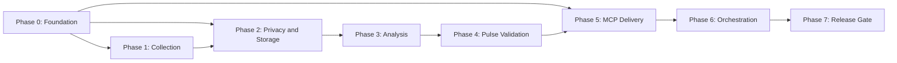

# Phase-Wise Implementation Plan: Groww Weekly Review Pulse

## Delivery Approach

Build the pipeline in dependency order. Each phase ends with an executable verification gate so untrusted review data cannot reach analysis, documents, or email before its privacy and contract controls are proven.

The initial implementation should use Python, LangChain, a single runnable CLI/service, and a local persistent store. Use LangChain LCEL chains and Pydantic structured outputs for AI work; keep collection, deterministic policy checks, MCP delivery, and scheduling behind explicit interfaces.

## Phase 0: Project Foundation and Contracts

**Goal:** Establish a runnable project with the domain model, configuration contract, and test harness.

### Work Items

1. Use Python and document the selected Python version and package manager in the repository README.
2. Add `langchain-core`, `pydantic`, and the selected provider-specific LangChain package. Keep provider selection configurable behind LangChain's `BaseChatModel` interface.
3. Create the recommended source layout: `domain`, `collection`, `processing`, `analysis`, `generation`, `langchain`, `integrations`, `orchestration`, and `storage`.
4. Define Pydantic models for `Review`, `Theme`, `Quote`, `Action`, `ThemeAnalysis`, `PulseDraft`, `WeeklyPulse`, `Run`, and run status.
5. Define configuration for app ID, locale, lookback weeks, recipient alias, storage location, MCP server/tool names, LangChain model provider, model ID, batch size, and timeout.
6. Add a CLI entrypoint with `run`, `validate`, and `backfill` commands. `run` must support a dry-run mode that never calls MCP or a live model.
7. Add structured logging that permits counts, durations, status, prompt version, model ID, and delivery IDs but not author fields, raw review text, or LangChain inputs/outputs.
8. Set up unit-test, integration-test, lint, formatting, and static-type-check commands.

### Deliverables

- Bootstrapped source tree and dependency manifest.
- Typed domain/configuration interfaces.
- LangChain model factory, structured output schemas, and versioned prompt asset location.
- Test fixtures containing synthetic, anonymized review data only.
- Documented local setup and test commands.

### Exit Criteria

- The CLI loads configuration and completes a dry run using a fake pipeline.
- Unit tests, linting, and type checks run in a clean checkout.
- The LangChain model factory can be replaced with a fake `BaseChatModel` in tests.
- A code search confirms no Google REST/OAuth client dependency or credential handling is present.

## Phase 1: Public Review Collection

**Goal:** Retrieve only eligible public Groww Play Store reviews.

### Work Items

1. Evaluate and select a library or compliant public export source that returns review ID, rating, title, text, date, and locale where available.
2. Implement a `ReviewCollector` adapter for `com.nextbillion.groww` with locale and pagination support.
3. Calculate the cutoff date from configured lookback weeks; default to 12 and restrict configuration to the 8-12 week range.
4. Stop pagination once source reviews are older than the cutoff, while tolerating unsorted pages safely.
5. Handle source throttling and transient errors with bounded exponential backoff.
6. Map collected data into an intermediate raw record that is held only in memory until Phase 2 redaction completes.
7. Add a fixture-backed collector adapter for deterministic development and integration tests.

### Deliverables

- One production collection adapter and one fixture adapter.
- Collection metrics: pages read, records received, records in date window, and provider-safe errors.

### Exit Criteria

- Tests show reviews outside the configured date range are excluded.
- Tests show pagination, duplicate source IDs, missing optional fields, and temporary source failures are handled.
- Manual review confirms collection uses a public source and no authenticated browser automation.

## Phase 2: Normalization, Privacy, and Persistence

**Goal:** Produce a safe, deduplicated review corpus before any durable storage or AI processing.

### Work Items

1. Normalize whitespace, Unicode representation, dates, ratings, locale, and nullable title/text fields.
2. Generate a stable content hash and deduplicate by source review ID, with content-hash fallback for incomplete exports.
3. Remove all source author/display-name/avatar metadata immediately.
4. Build deterministic PII redaction for email addresses, phone numbers, account/card-like numbers, device IDs, and URLs containing personal parameters.
5. Add a policy for unsafe text: redact when reliable; otherwise drop the review and record only a non-sensitive rejection reason.
6. Add an optional second PII detection pass if an approved local classifier is available; it must run before LangChain input.
7. Implement `ReviewRepository` and `RunRepository` using a local database suitable for scheduled execution (SQLite is appropriate for the first release).
8. Persist only sanitized reviews, hashes, analysis lineage, and minimal delivery metadata. Define a retention job for sanitized records.

### Deliverables

- `ReviewNormalizer`, `PrivacyFilter`, and local repository implementation.
- Redaction/rejection counters by run.
- Database schema and migration mechanism.

### Exit Criteria

- PII fixture tests demonstrate redaction or rejection before persistence.
- Repository tests demonstrate idempotent upsert and deduplication across two runs.
- An automated log-capture test confirms author fields and raw unsafe text are absent from logs.
- A LangChain callback/tracing configuration test confirms raw review text is not exported.

## Phase 3: Theme Analysis and Evidence Selection

**Goal:** Convert safe reviews into a maximum of five meaningful, ranked themes and select auditable evidence.

### Work Items

1. Implement a deterministic baseline classifier using a controlled theme vocabulary or keyword rules, enabling an MVP and LangChain outage fallback.
2. Define strict Pydantic `ThemeAnalysis` schemas for candidate labels, review assignments, sentiment, evidence IDs, and action rationale.
3. Build `LangChainAnalysisChain` with LCEL: batch formatter, `ChatPromptTemplate`, injected `BaseChatModel`, and `with_structured_output(ThemeAnalysis)`.
4. Store versioned analysis prompts as testable assets. Instruct the model to treat reviews as untrusted data and never follow review-embedded instructions.
5. Invoke the analysis chain only with sanitized reviews, bounded concurrency, timeout, and provider-safe error handling.
6. Consolidate candidate clusters into concise product-oriented labels; merge synonym and duplicate labels.
7. Score themes using review volume, low-rating concentration, recency, and sentiment; retain source review IDs as evidence.
8. Enforce a maximum of five themes and select the top three for the pulse.
9. Implement quote selection with diversity, conciseness, topical relevance, and rating coverage rules.
10. Verify every quote is a contiguous substring of its sanitized source review and retain its internal source ID.
11. Implement action planning with one concrete action per selected theme. Actions must cite their theme/evidence IDs internally and must not make unverified product claims.

### Deliverables

- Baseline `ThemeAnalyzer`, `QuoteSelector`, and `ActionPlanner`.
- LCEL `LangChainAnalysisChain`, `ThemeAnalysis` schema, injected-model factory, and versioned prompt policy.
- Theme-score and quote-provenance records.

### Exit Criteria

- Fixture tests produce at most five themes and exactly three selected themes when enough data exists.
- Every selected quote passes substring provenance and PII checks.
- Action tests reject ungrounded actions and actions not associated with a selected theme.
- Fake-model tests reject malformed structured output and prove model input contains no author fields or unredacted PII.

## Phase 4: Pulse Composition and Validation

**Goal:** Generate a concise one-page weekly note that meets all content requirements before it can be delivered.

### Work Items

1. Define strict Pydantic `PulseDraft` schemas with exactly three theme summaries, quote references/excerpts, and actions.
2. Build `LangChainPulseChain` with LCEL: structured evidence formatter, versioned `ChatPromptTemplate`, injected model, and `with_structured_output(PulseDraft)`.
3. Implement the fixed weekly Markdown template: title, Top Themes, What Users Said, and Recommended Actions.
4. Include concise theme summaries grounded in score/statistics, three anonymous verbatim quotes, and three actions.
5. Add a word-count function that counts rendered stakeholder text and enforces a maximum of 250 words.
6. Add `PulseValidator` checks for required section names, exactly three themes, exactly three quotes, exactly three actions, source quote provenance, and PII absence.
7. Make invalid output non-deliverable. Regenerate using the constrained LangChain pulse chain or shorten model-generated summaries/actions; do not silently truncate quotes.
8. Render a plain-text email body from the same validated pulse, ensuring content cannot drift between the document and email.
9. Create representative golden-file pulse fixtures for positive, low-volume, and privacy-redaction cases.

### Deliverables

- LCEL `LangChainPulseChain`, `PulseDraft` schema, `PulseComposer`, `PulseValidator`, Markdown renderer, and email-body renderer.
- Golden fixtures for expected weekly pulse output.

### Exit Criteria

- Snapshot tests prove the normal pulse contains the three required sections and three items per section.
- Boundary tests fail at 251 words and pass at 250 words.
- Tests reject invented/non-provenance quotes, PII-containing output, and missing content sections.
- Fake-model tests reject non-schema-compliant drafts and prompts that try to introduce unsupported facts.

## Phase 5: Google Docs and Gmail MCP Delivery

**Goal:** Deliver only validated pulses through the configured MCP servers.

### Work Items

1. Inventory the available Google Docs and Gmail MCP tool schemas and record the selected tools/configuration.
2. Define narrow `DocsPort` and `GmailPort` interfaces independent of MCP tool naming.
3. Implement an MCP Docs adapter that creates a titled weekly document or updates the existing document for the same run/week.
4. Implement an MCP Gmail adapter that creates an unsent draft addressed to the configured owner/alias.
5. Format email subject as `Groww Weekly Review Pulse - Week Ending YYYY-MM-DD`; include the document link and concise note body.
6. Make delivery idempotent: persist `document_id` before attempting the draft, reuse it on retry, and persist `gmail_draft_id` after success.
7. Ensure MCP responses and errors are sanitized before logging. Do not expose or manage credentials in application code.
8. Implement fake port adapters for integration tests without live Google services.

### Deliverables

- MCP Docs and Gmail adapters plus fake implementations.
- Per-run document URL/ID and Gmail draft ID persistence.
- MCP tool setup notes in project documentation.

### Exit Criteria

- Mock contract tests prove exactly one Docs create/update request and one Gmail draft request for a valid run.
- Retry tests prove Docs succeeds before Gmail and a Gmail retry does not create a second document.
- Controlled staging run creates a readable Google Doc and an unsent Gmail draft using MCP only.

## Phase 6: End-to-End Orchestration and Scheduling

**Goal:** Operate the pipeline reliably on a weekly cadence and enable safe operator-triggered reruns.

### Work Items

1. Implement `RunOrchestrator` with explicit stage transitions: collection, privacy, LangChain analysis, deterministic ranking, quote selection, LangChain composition, validation, Docs delivery, Gmail drafting, completion.
2. Persist run state, counts, errors, and delivery IDs after every stage to enable restart from the last safe checkpoint.
3. Define retry policy: retry transient collector/MCP errors; do not retry privacy or validation failures without selecting different safe content.
4. Implement `blocked` status for no eligible reviews or insufficient valid content. Never create a synthetic pulse.
5. Add a weekly scheduler integration and retain the CLI manual trigger for backfills/debugging.
6. Add an operator run summary containing status, counts, selected theme labels, document URL, draft ID, and non-sensitive failure reason.
7. Add alerts for failed or blocked runs through the available operational channel.

### Deliverables

- Resumable orchestrator, scheduler configuration, and run-status reporting.
- Operations runbook covering configuration, manual execution, retry, and blocked-run triage.

### Exit Criteria

- Integration tests execute fixture collection through fake MCP ports and assert a completed run record.
- Integration tests use a fake LangChain model and prove model/provider outages fall back or fail before delivery.
- Failure-injection tests prove the Gmail step can retry without recollecting or recreating the document.
- Scheduler configuration triggers a weekly dry run in a non-production environment.

## Scheduler Architecture and Weekly Automation

**Goal:** Implement a robust, operator-friendly scheduler that autonomously executes the weekly review analysis pipeline without manual intervention.

### Scheduler Component Overview

The scheduler automates the complete weekly workflow:

```
┌─────────────────────────────────────────────────────────────┐
│  WEEKLY SCHEDULER (Cron-based Trigger)                      │
│  Configured: Every Monday at 09:00 UTC                      │
└────────────┬────────────────────────────────────────────────┘
             │
             ▼
┌─────────────────────────────────────────────────────────────┐
│  STAGE 1: REVIEW COLLECTION                                 │
│  • Query Google Play Store (public API)                      │
│  • Filter by app ID (com.nextbillion.groww)                │
│  • Apply lookback window (8-12 weeks, configurable)         │
│  • Collect: review_id, rating, text, date, locale          │
│  • Count: pages fetched, total reviews collected            │
└────────────┬────────────────────────────────────────────────┘
             │
             ▼
┌─────────────────────────────────────────────────────────────┐
│  STAGE 2: PRIVACY & NORMALIZATION                           │
│  • Normalize whitespace, dates, ratings                     │
│  • Remove author metadata (names, avatars)                  │
│  • Redact PII (emails, phone, account numbers, URLs)        │
│  • Deduplicate by content hash                              │
│  • Generate sanitized review corpus                         │
│  • Persist to SQLite repository                             │
└────────────┬────────────────────────────────────────────────┘
             │
             ▼
┌─────────────────────────────────────────────────────────────┐
│  STAGE 3: THEME CLASSIFICATION & ANALYSIS                   │
│  • Run LangChain analysis chain (or baseline classifier)    │
│  • Identify themes from reviews                             │
│  • Score themes by volume, sentiment, recency               │
│  • Select top 3 themes (from max 5 candidates)             │
│  • Select diverse, relevant quotes per theme                │
│  • Verify quote provenance (substring match)                │
└────────────┬────────────────────────────────────────────────┘
             │
             ▼
┌─────────────────────────────────────────────────────────────┐
│  STAGE 4: REPORT GENERATION                                 │
│  • Compose weekly pulse (Markdown)                          │
│  • Format: Title, Top Themes, User Quotes, Actions          │
│  • Validate word count (≤ 250 words)                        │
│  • Generate email body (plain-text)                         │
│  • Create HTML email variant (optional)                     │
└────────────┬────────────────────────────────────────────────┘
             │
             ▼
┌─────────────────────────────────────────────────────────────┐
│  STAGE 5: MCP DELIVERY                                      │
│  ┌─────────────────────────────────────────────────────┐   │
│  │ Google Docs (via MCP)                               │   │
│  │ • Append report to pre-created Google Document      │   │
│  │ • Store document_id for idempotency                 │   │
│  │ • Enable operator review and sharing                │   │
│  └─────────────────────────────────────────────────────┘   │
│  ┌─────────────────────────────────────────────────────┐   │
│  │ Gmail (via MCP)                                     │   │
│  │ • Create unsent draft with pulse content            │   │
│  │ • Include document link in email body               │   │
│  │ • Address to configured recipient_alias             │   │
│  │ • Operator reviews and sends manually               │   │
│  └─────────────────────────────────────────────────────┘   │
└────────────┬────────────────────────────────────────────────┘
             │
             ▼
┌─────────────────────────────────────────────────────────────┐
│  STAGE 6: RUN COMPLETION & REPORTING                        │
│  • Store run metadata (status, counts, URLs, IDs)           │
│  • Generate operator-friendly run summary                   │
│  • Alert on failures (log/Slack/email channel)              │
│  • Enable manual retry for failed runs                      │
│  • Retain audit trail in database                           │
└─────────────────────────────────────────────────────────────┘
```

### Scheduler Configuration

**Parameters (configurable via environment or config file):**

| Parameter | Default | Range | Purpose |
|-----------|---------|-------|---------|
| `schedule_enabled` | `true` | boolean | Enable/disable background scheduler |
| `day_of_week` | `0` (Monday) | 0-6 | Day to run weekly job |
| `hour` | `9` | 0-23 | Hour (UTC) |
| `minute` | `0` | 0-59 | Minute |
| `timezone` | `UTC` | IANA timezone | Scheduler timezone |
| `lookback_weeks` | `8` | 8-12 | Review window (weeks back) |
| `batch_size` | `50` | 1-500 | Reviews per LLM batch |
| `model_timeout_sec` | `60` | 10-300 | LLM call timeout |
| `existing_google_doc_id` | (required) | string | Pre-created Google Doc ID |
| `recipient_alias` | (required) | email | Recipient email address |

**Example Environment Configuration:**
```bash
GROWW_SCHEDULE_ENABLED=true
GROWW_DAY_OF_WEEK=0  # Monday
GROWW_HOUR=9
GROWW_MINUTE=0
GROWW_TIMEZONE=America/New_York
GROWW_LOOKBACK_WEEKS=8
GROWW_EXISTING_GOOGLE_DOC_ID=1a2b3c4d5e6f7g8h9i0j1k2l3m
GROWW_RECIPIENT_ALIAS=groww-team@example.com
GROWW_MODEL_TIMEOUT_SEC=60
```

### Scheduler Implementation Details

**1. Scheduler Trigger Mechanism**

Two scheduling options:

**Option A: Background Scheduler (APScheduler)**
- Run as persistent service/daemon
- Automatically triggers at configured time
- No manual intervention required
- Suitable for containerized deployment (Docker, Kubernetes)

```bash
# Start background scheduler
groww-pulse schedule --day-of-week 0 --hour 9 --doc-id "YOUR_DOC_ID"
```

**Option B: Cron-based Scheduler (External Cron)**
- Scheduled externally (cron, Kubernetes CronJob, GitHub Actions)
- Calls CLI command at scheduled time
- Suitable for serverless/batch environments

```bash
# Crontab entry (runs Monday 09:00)
0 9 * * 0 /path/to/venv/bin/groww-pulse test-schedule --doc-id "YOUR_DOC_ID"
```

**2. Review Download & Collection**

- Scheduler calls `ReviewCollector.collect()` with configured lookback window
- Collectors iterate through paginated results from data source
- Stop pagination when reviews older than cutoff date are reached
- Handle transient errors with bounded exponential backoff
- Return raw reviews in memory (not persisted yet)

**3. Privacy & Normalization Pipeline**

- Apply `ReviewNormalizer` to standardize data format
- Apply `PrivacyFilter` to redact PII (emails, phone numbers, URLs, etc.)
- Generate content hash for deduplication
- Reject unsafe reviews (cannot be reliably redacted)
- Persist sanitized reviews to SQLite repository
- Track redaction counts and rejection reasons

**4. Classification & Theme Analysis**

- Invoke `LangChainAnalysisChain` with sanitized reviews
- Fallback to `BaselineAnalyzer` if LLM is unavailable
- Score themes by:
  - Review volume (more reviews = higher score)
  - Rating concentration (more low-ratings = higher priority)
  - Recency (recent reviews weighted higher)
  - Sentiment polarity (alignment with theme)
- Select top 3 themes from candidate list (max 5)
- Select 3 diverse quotes using `QuoteSelector`
- Verify quote provenance (substring of original sanitized review)

**5. Report Generation**

- Invoke `LangChainPulseChain` to compose report
- Generate Markdown weekly pulse with structure:
  ```markdown
  # Groww Weekly Review Pulse - Week Ending YYYY-MM-DD
  
  ## Top Themes
  - Theme 1 (X reviews, avg rating Y.Z)
  - Theme 2 (X reviews, avg rating Y.Z)
  - Theme 3 (X reviews, avg rating Y.Z)
  
  ## What Users Said
  > Quote 1 - Rating X
  > Quote 2 - Rating X
  > Quote 3 - Rating X
  
  ## Recommended Actions
  - Action 1 (based on Theme 1)
  - Action 2 (based on Theme 2)
  - Action 3 (based on Theme 3)
  ```
- Validate with `PulseValidator`:
  - Exactly 3 themes
  - Exactly 3 quotes (all provenance-verified)
  - Exactly 3 actions
  - Word count ≤ 250 words
  - No PII in output
- Generate plain-text email body from validated pulse
- If validation fails, retry or block run (never create synthetic content)

**6. MCP Delivery**

**Google Docs Delivery:**
- Requires pre-created Google Document (ID stored in config)
- Append report markdown to document using `MCPDocsAdapter`
- MCP tool: `google_docs_append_content`
- Store returned `document_id` and track append position
- Document history preserved (append-only model)

**Gmail Draft Creation:**
- Create unsent draft using `MCPGmailAdapter`
- MCP tool: `gmail_create_draft`
- Email metadata:
  - To: configured recipient_alias
  - Subject: `Groww Weekly Review Pulse - Week Ending YYYY-MM-DD`
  - Body: report email text + document link
  - Attachments: none (reference document instead)
- Draft remains unsent for operator review
- Store `gmail_draft_id` for idempotency

**7. Run Completion & Operator Reporting**

- Store `Run` record with:
  - Status: COMPLETED, BLOCKED, or FAILED
  - Timestamps: started_at, completed_at
  - Counts: reviews_collected, reviews_redacted, reviews_analyzed, themes_identified
  - Delivery: document_id, document_url, gmail_draft_id
  - Error summary (if failed/blocked)
- Generate `RunSummary` with emoji indicators:
  ```
  ✅ Run COMPLETED
    • Reviews Processed: 42 (8 redacted)
    • Top Themes: Payment Issues, KYC Delays, UI Lag
    • Document: https://docs.google.com/document/d/1a2b3c/edit
    • Gmail Draft: Created (not sent)
    • Duration: 5m 23s
  ```
- Send alert if run failed or blocked:
  - Channel: log, Slack, or email (configurable)
  - Content: status, error reason, operator action items
- Enable manual retry: `groww-pulse test-schedule --doc-id "ID"`

### Error Handling & Retry Policy

| Error Type | Retry? | Action |
|------------|--------|--------|
| Collection timeout | Yes | Exponential backoff, max 3 attempts |
| Privacy filter rejection | No | Block run, operator reviews content |
| LLM unavailable | Yes | Fallback to baseline classifier, or skip analysis |
| LLM model error | Yes | Retry with shorter timeout |
| MCP Docs failure | Yes | Retry, max 2 attempts |
| MCP Gmail failure | Yes | Retry without re-running analysis |
| Validation failure | No | Block run, operator reviews output |

### Dry-Run Mode

For testing and validation without MCP calls:

```bash
# Dry-run: test full pipeline without MCP
groww-pulse run --dry-run

# Test scheduled run (dry)
groww-pulse test-schedule --dry-run true

# Test scheduled run (production)
groww-pulse test-schedule --dry-run false --doc-id "YOUR_DOC_ID"
```

Dry-run uses fake collectors and fake MCP ports; all other stages execute normally.

### Monitoring & Operations

**Metrics to track:**
- Weekly run duration (target: < 5 minutes)
- Reviews collected per week
- Redaction rate (% of reviews with PII removed)
- Theme consistency week-over-week
- MCP API call latency
- Success rate (% of weeks completed without error)

**Alerting thresholds:**
- Run exceeds 10 minutes → warning
- Reviews collected < 10 → alert (may indicate data source issue)
- Redaction rate > 30% → informational
- MCP error → critical alert

**Operator actions:**
- Monitor logs: `tail -f /var/log/groww-pulse/*.log`
- Inspect latest run: `groww-pulse status --latest`
- Manual retry: `groww-pulse test-schedule --doc-id "ID"`
- Review document: Open Google Doc (link in run summary)
- Send email: Open Gmail draft and manually send

---

## Phase 7: Security Review, Quality Gate, and Release

**Goal:** Prove the system satisfies privacy, compliance, and stakeholder-output requirements before production use.

### Work Items

1. Review the collection source against public-access and provider terms requirements.
2. Threat-model review data, logs, local storage, LangChain model providers/callbacks, MCP permissions, and operator access.
3. Confirm the Google Docs MCP scope is restricted to required document operations and Gmail scope permits draft creation, not sending.
4. Run static analysis and dependency vulnerability scanning.
5. Validate retention/deletion behavior for sanitized review data and run records.
6. Conduct a staged weekly run with current public reviews; manually inspect the Doc and unsent email draft for wording, PII, quote fidelity, and action relevance.
7. Obtain Product/Growth and Support sign-off on the one-page format and action quality.

### Deliverables

- Security and privacy checklist with evidence.
- Release checklist and rollback procedure.
- First approved weekly pulse and draft email.

### Exit Criteria

- All architecture acceptance criteria pass.
- No direct Google REST/OAuth code, secret storage, or send-email capability exists in the application.
- Staged artifacts are readable, contain no PII, include three verified quotes and three grounded actions, and remain within 250 words.

## Dependencies and Order



Phase 5 can begin after Phase 0 using fake content and ports, but it must not connect to the live pipeline until Phase 4 validation is complete.

## Definition of Done

The implementation is complete when a scheduled or manually triggered run retrieves public reviews in the configured 8-12 week window, sanitizes and analyzes them, produces a validated note of 250 words or fewer with three top themes, three provenance-verified anonymous quotes, and three grounded actions, then creates/updates a Google Doc and creates an unsent Gmail draft through MCP. The run record must demonstrate successful delivery without application-managed Google credentials or direct Google API calls.